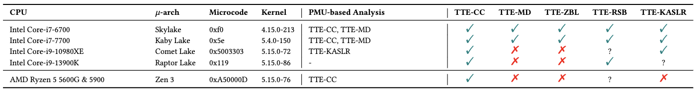

# Whisper: Timing the Transient Execution to Leak Secrets and Break KASLR

This repository contains the experiments of evaluation and analysis tools introduce in the paper

- "Whisper: Timing the Transient Execution to Leak Secrets and Break KASLR" (DAC'24)

You can find the paper at hte [61 DAC Proceedings website](https://www.dac.com/proceedings61).

## Overview

We report a novel timing side channel based on Transient Execution Timing (TET). Using TET, we have successfully implemented many known side-channel attacks (SCA) including TET-Meltdown, TET-Zombieload, and TET-Spectre-RSB. More importantly, we show that KASLR under the state-of-the-art protection of KPTI and FLARE can also be broken with the proposed TET side channel. We conduct an in-depth analysis and verify on commercial CPUs that the proposed TET channel is stealthy and easy to construct.

## PoC Structure

```shell
./pocs/ $ tree -d -L 2
├── tet-cc-md-zbl-rsb-poc
│   ├── TET-MD
│   ├── TET-RSB
│   └── TET-ZBL
└── tet-kaslr-poc
    ├── i7-6700
    ├── i7-7700
    └── i9-10980XE
```



## Citation

```latex
@inproceedings{Yu2024Whisper,
  author={Yu Jin, Chunlu Wang, Pengfei Qiu, Chang Liu, Yihao Yang, Hongpei Zheng, Yongqiang Lyu, Xiaoyong Li, Gang Qu and Dongsheng Wang},
  booktitle={2024 61th ACM/IEEE Design Automation Conference (DAC)},
  title={{Whisper: Timing the Transient Execution to Leak Secrets and Break KASLR}},
  year={2024}
}
```

## Contact

If you have any questions, please email to `lambda.jinyu (AT) gmail.com`.
